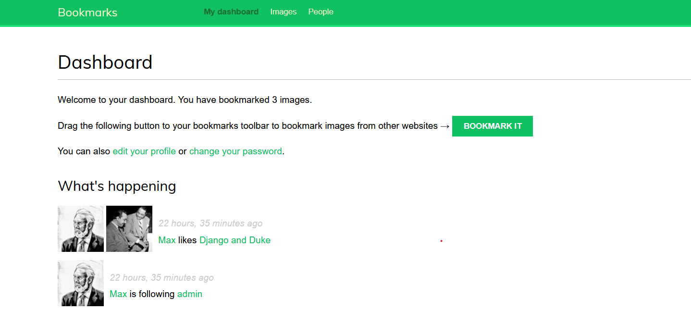

# Bookmarks

   

Social website for saving images using bookmarklets.

## Description

Bookmarks allows to:

- view saved images
- like images
- follow other users and view their images
- view all active users
- view image ranking by views or likes

## Requirements

- python3.8+
- pip
- virtualenv
- Django3.1+
- Redis

### Virtual environment

Please pay attention that env variables should be places at the end of file `venv/bin/activate` (Linux) or `venv/Scripts/activate` (Windows) for security reasons. Also, they should be unset in function `deactivate`

#### activate
```bash

deactivate() {
    ...

    unset SOCIAL_AUTH_FACEBOOK_KEY
    unset SOCIAL_AUTH_FACEBOOK_SECRET
    unset SECRET_KEY
    unset SOCIAL_AUTH_GOOGLE_OAUTH2_KEY
    unset SOCIAL_AUTH_GOOGLE_OAUTH2_SECRET
}

...
export SECRET_KEY="key"
export SOCIAL_AUTH_FACEBOOK_KEY="key"
export SOCIAL_AUTH_FACEBOOK_SECRET="secret"
export SOCIAL_AUTH_GOOGLE_OAUTH2_KEY="key"
export SOCIAL_AUTH_GOOGLE_OAUTH2_SECRET="secret"
```

### Auth using Facebook and Google

In order to provide sufficient security level run server with command

```bash
python manage.py runserver_plus --cert-file cert.crt
```


### Redis server

Install Redis on [Linux](https://redis.io/download) or [Windows](https://redislabs.com/blog/redis-on-windows-10/) and run server in separate terminal


## Example


